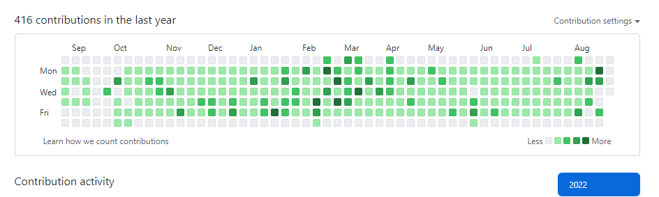
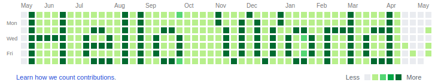
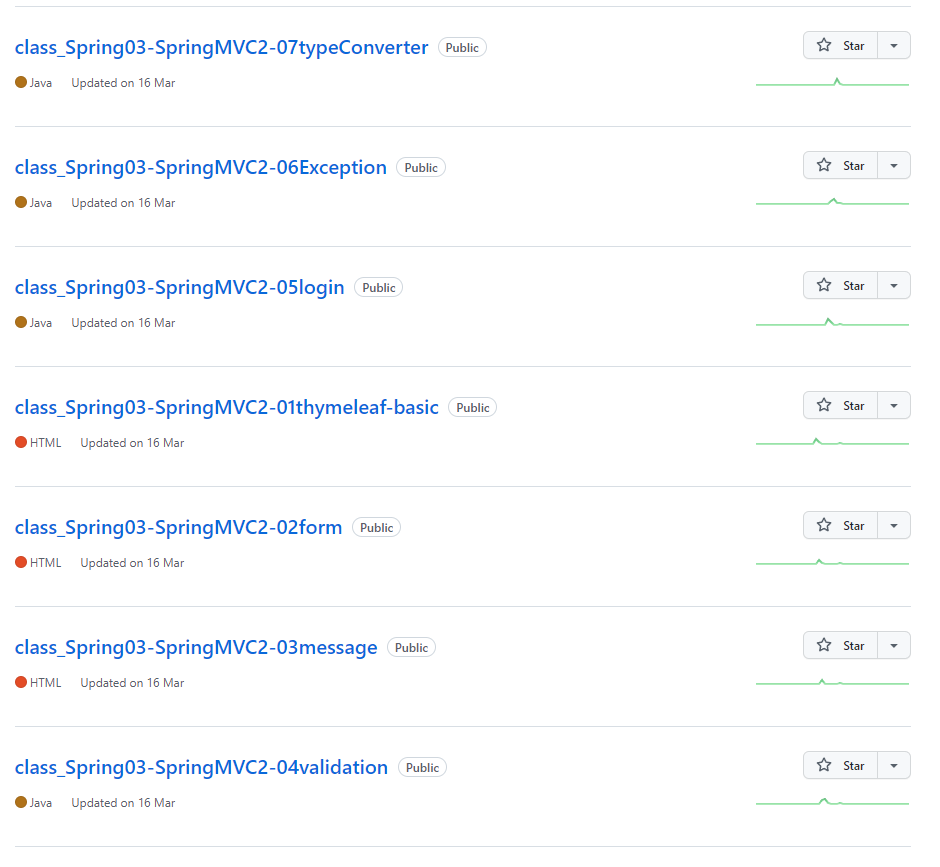
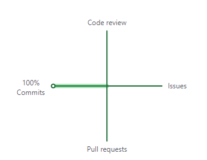
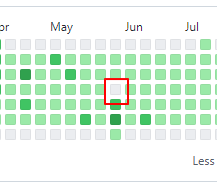

### 1일 1커밋 💻
 - 2021년, 가을이 한창인 10월. 1일 1커밋을 해보기로 하였다.
 - 오픈한 프로젝트가 안정화기에 들어서면서, 먼가 꾸준히 할 여력이 생겼기 때문
 - 그 결과 아래와 같이 꽤나 빽빽한 잔디밭을 형성 할 수 있었다.
    + 주말에 비는건 눈감아주세요. 처자식이 있습니다.
 
 
  > 이런것도 해보고 싶다.

 

### 무엇을 커밋하였을까 🚀
 - 대부분 강의를 듣고 실습한 내용이다.
 
 > class로 시작하는 repository는 강의 실습 respository

### 처음에는 이대로도 좋은 줄 알았다. 🤣

 - 예쁘지 않아도 좋다. 그래도 무언가 꾸준히 하였다는 증거이니깐
 - 다음날 회식과 같은 이벤트가 있는 경우는 2일치를 미리 하고 자정이 넘어가면 push 하였다.
 - 나름 ```꾀돌이``` 같다고도 생각했었다.
 
 ### 과연 이게 맞을까? 🤔
 - 설 명절, 연말, 심지어 휴가중에도 1일 1커밋을 했다
   * 휴가중에도 한 건 지금 생각해도 대단하다.
 - 꼼수로 하는 경우도 있었다. 어찌 매번 의미있는 커밋만 있으랴
 - 그런데 그런 꼼수가 잦아질수록, 마음 한켠이 아려오는건 애써 외면 했다.

### 그럼 이제 그만두는 거야? 😅
 - 그만둬야 겠다고 마음 먹은건 사실 꽤 되었다.
 - 커밋 이력을 보면 5월에 코드를 짜놓고선 커밋을 하지 않은 이력이 딱 하나 눈에 띈다.
 - 이 빈공간이 아주 커다란 스트레스와 짜증으로 다가왔다.

   
 - 이게 ```trigger```가 되었으리라. 붕괴는 작은 균열로부터 시작하는 법이지.
 - 이 후 ```1일1커밋``` 활동에 대해 꾸준히 고민을 해왔다.
 - 그럼에도 금방 그만두지 않은 건 진행중이 강의가 꽤 남아 있었기 때문.
 
### How보단 Why가 중요
 - 일반적으로 how가 중요하다.
 - 1일 1커밋을 시작한 초심은 옅어지고, 기계적으로, 가끔은 꼼수로 심는 잔디가 과연 잘 자랄까?
 - 중요한 건 ***왜*** 하는지가 중요

### 꾸준함은 결코 쉬운 게 아니야
 - 